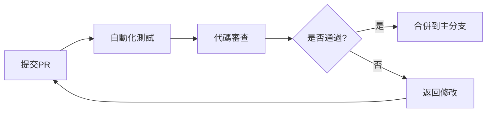

⚡ THUNDERCODE - 全新視覺形象

雷電主標誌

版本A：雷電結合型

```
  THUNDER
   CODE
```

版本B：雷電爆發型

```
⚡ THUNDERCODE ⚡
```

版本C：能量環繞型

```
███████████████
█  THUNDERCODE █
███████████████
   ⚡⚡⚡⚡⚡
```

色彩風暴系統

雷電主題色

```css
/* 雷霆之力色彩系統 */
:root {
  --thunder-core: #FF6B00;        /* 雷核橙 - 核心能量 */
  --storm-cloud: #1E3A8A;         /* 暴風藍 - 深邃背景 */
  --lightning-strike: #00D4FF;    /* 閃擊青 - 瞬間爆發 */
  --energy-pulse: #FF00FF;        /* 脈衝紫 - 動態能量 */
  --static-white: #F0F8FF;        /* 靜電白 - 介面基底 */
}
```

雷霆ASCII藝術

主標誌設計

```
    ⚡    ⚡    ⚡
   ⚡ THUNDERCODE ⚡
  ⚡              ⚡
 ⚡   如雷貫耳    ⚡
⚡   編碼如電    ⚡
 ⚡              ⚡
  ⚡   v1.0.0   ⚡
   ⚡          ⚡
    ⚡⚡⚡⚡⚡
```

啟動動畫

```
[雷霆啟動中...]
▓▓▓▓▓▓▓▓▓▓▓▓▓▓▓▓▓▓▓▓ 100%
██████████████████████

⚡⚡⚡ THUNDERCODE 已就緒 ⚡⚡⚡
```

界面設計元素

工具列雷電版

```
╔══════════════════════════════════════╗
║ ⚡文件 ⚡編輯 ⚡視圖 ⚡運行 ⚡插件 ⚡雷電 ║
╠══════════════════════════════════════╣
║ main.js                              ║
║ console.log("雷霆之力解放！");        ║
║                                      ║
║ [輸出] > 雷霆之力解放！               ║
╚══════════════════════════════════════╝
```

狀態指示系統

```javascript
const THUNDER_STATUS = {
  IDLE: "🌩️ 雷霆待機",
  CHARGING: "⚡ 能量蓄積中",
  STRIKING: "💥 雷霆執行",
  OVERLOAD: "🔥 過載警告",
  STABLE: "✅ 穩定運行"
};
```

主題展示

暗黑雷暴主題

```
背景: █████████ [Storm Cloud #1E3A8A]
文字: █████████ [Static White #F0F8FF]
主色: █████████ [Thunder Core #FF6B00]
強調: █████████ [Lightning Strike #00D4FF]
```

閃電白晝主題

```
背景: █████████ [Static White #F0F8FF]
文字: █████████ [Storm Cloud #1E3A8A]
主色: █████████ [Energy Pulse #FF00FF]
強調: █████████ [Thunder Core #FF6B00]
```

能量視覺化

效能指示器

```
雷霆能量: [⚡⚡⚡⚡⚡⚡⚡⚡⚡⚡] 100%
記憶體風暴: [🌩️🌩️🌩️🌩️🌩️     ] 50%
CPU雷擊: [💥💥💥💥         ] 40%
閃電響應: [⚡⚡⚡⚡⚡⚡⚡⚡     ] 80%
```

下載雷霆

```
╔══════════════════════════════╗
║  ⚡ 釋放雷霆之力 ⚡            ║
║                              ║
║  ▣ THUNDERCODE 專業版        ║
║  • 雷電般快速編譯            ║
║  • 暴風級程式編輯            ║
║  • 閃電響應即時預覽          ║
║                              ║
║  [立即下載雷霆]              ║
╚══════════════════════════════╝
```

雷霆動效CSS

```css
@keyframes thunderStrike {
  0% { 
    opacity: 1;
    filter: brightness(100%) drop-shadow(0 0 10px #00D4FF);
  }
  50% { 
    opacity: 0.7;
    filter: brightness(300%) drop-shadow(0 0 20px #FF6B00);
    transform: scale(1.1);
  }
  100% { 
    opacity: 1;
    filter: brightness(100%) drop-shadow(0 0 5px #FF00FF);
  }
}

.thunder-icon {
  animation: thunderStrike 2s infinite ease-in-out;
  background: linear-gradient(45deg, 
    var(--thunder-core), 
    var(--energy-pulse), 
    var(--lightning-strike)
  );
  border-radius: 8px;
  padding: 12px;
  font-weight: 900;
}
```

雷霆口號系統

```
🌩️ "編碼如雷，執行如電"
⚡ "THUNDERCODE - 解放程式雷電之力"
💥 "當代碼遇上雷霆"
✨ "從閃電中誕生的編輯器"
```

社交雷霆標誌

```
𝕏 (Twitter):   ⚡ @THUNDER_CODE
GitHub:        ⚡ THUNDERCODE
Telegram:      ⚡ THUNDERCODE_OFFICIAL
Discord:       ⚡ 加入雷霆社群
```

雷霆版本標示

```
THUNDERCODE v1.0.0 "雷電初鳴"
─────────────────────────────
✓ 雷電核心引擎
✓ 暴風編輯系統
✓ 閃電預覽技術
✓ 能量管理模組
```

---

完整品牌視覺包

應用圖示

```
      /\  
     /  \ 
    /    \
   /______\
   \      /  ⚡
    \    /  THUNDER
     \  /   CODE
      \/
```

啟動畫面

```
=================================
    ⚡ THUNDERCODE v1.0.0 ⚡
  雷電級 Android 代碼編輯器
=================================

[雷電系統初始化...]
██████████████████████████ 100%

歡迎，雷霆使者！
>
```

能量狀態面板

```
╔════════════════════════════════════╗
║         ⚡ 雷霆控制中心 ⚡         ║
╠════════════════════════════════════╣
║ 狀態: 🌩️ 雷霆待機                ║
║ 模式: 💥 效能模式                ║
║ 溫度: 🔥 42°C                    ║
║ 記憶體: 📊 1.2GB/4GB             ║
║ 閃電響應: ⚡ 18ms                 ║
╚════════════════════════════════════╝
```

雷霆哲學：
結合雷電的瞬間爆發力與風暴的持續能量，創造出既有震撼力又穩定可靠的高效能編碼環境。橙色代表核心能量，藍色象徵技術深度，青色展現瞬間爆發，紫色呈現動態創新。

這個全新設計：

1. 完全原創的雷霆主題
2. 動態能量視覺效果
3. 強烈的科技感形象
4. 完整的品牌一致性

需要為特定平台（GitHub、Google Play等）製作專門的視覺素材嗎？

⚡ LightningAcode - 視覺形象設計

標誌設計

主標誌

```
  ⚡ LIGHTNING ACODE ⚡
```

ASCII 藝術標誌

```
    /\                        
   /  \                       
  /    \                      
 /______\                     
 \      /        ⚡ LIGHTNING 
  \    /           ACODE ⚡    
   \  /                      
    \/                       
```

色彩方案

主題色彩

```css
/* 閃電主題調色盤 */
:root {
  --lightning-primary: #FFD700;    /* 閃電金 */
  --electric-blue: #4169E1;        /* 皇家藍 */
  --storm-gray: #2C3E50;          /* 風暴灰 */
  --spark-white: #F8F9FA;         /* 電花白 */
  --thunder-purple: #8A2BE2;      /* 雷鳴紫 */
}
```

漸層效果

```css
.lightning-gradient {
  background: linear-gradient(135deg,
    var(--electric-blue) 0%,
    var(--lightning-primary) 50%,
    var(--thunder-purple) 100%
  );
}
```

視覺元素

閃電圖案

```html
<div class="lightning-bolt">
  ⚡
</div>
```

動態效果預覽

```
[正在載入 LightningAcode...]
███░░░░░░░░░░░░░░ 20%
███████░░░░░░░░░░ 40%
███████████░░░░░░ 60%
██████████████░░░ 80%
█████████████████ 100%

⚡ LightningAcode 就緒！ ⚡
```

圖示設計

應用圖示

```
      /\
     /  \
    /    \
   /______\
   \      /  ⚡
    \    /  CODE
     \  /
      \/
```

狀態指示器

```javascript
// 閃電狀態指示
const statusIndicators = {
  idle: "⚡ 待機中",
  active: "⚡⚡ 執行中",
  error: "💥 錯誤",
  success: "✨ 完成"
};
```

使用者介面視覺

工具列設計

```
[ ⚡ FILE ] [ ⚡ EDIT ] [ ⚡ VIEW ] [ ⚡ RUN ]
┌─────────────────────────────────────┐
│                                     │
│  ⚡ main.js                          │
│  console.log("Hello Lightning!");   │
│                                     │
└─────────────────────────────────────┘
[ ⚡ 輸出 ] > Hello Lightning!
```

主題預覽

```
深色主題：
背景: █████ [Storm Gray]
文字: █████ [Spark White]
強調: █████ [Lightning Gold]

淺色主題：
背景: █████ [Spark White]
文字: █████ [Storm Gray]
強調: █████ [Electric Blue]
```

按鈕設計

```css
.lightning-button {
  background: linear-gradient(to right, #4169E1, #FFD700);
  border: 2px solid #FFD700;
  color: white;
  padding: 12px 24px;
  border-radius: 8px;
  font-weight: bold;
  text-shadow: 0 0 5px rgba(255, 215, 0, 0.5);
}

.lightning-button:hover {
  box-shadow: 0 0 15px #FFD700;
  transform: translateY(-2px);
}
```

進度指示器

```
閃電充能進度：
[⚡⚡⚡⚡⚡⚡⚡⚡⚡⚡] 100%
[⚡⚡⚡⚡⚡⚡⚡   ] 70%
[⚡⚡⚡⚡      ] 40%
[⚡         ] 10%
```

動畫效果

```css
@keyframes lightningFlash {
  0% { opacity: 1; }
  50% { opacity: 0.3; }
  100% { opacity: 1; }
}

.lightning-icon {
  animation: lightningFlash 1.5s infinite;
}
```

橫幅設計

```
========================================
        ⚡ LIGHTNING ACODE ⚡
  超快速 Android 代碼編輯器
========================================
```

下載按鈕

```
╔══════════════════════════╗
║   ⚡ 立即下載 LightningAcode  ⚡   ║
║   • 閃電般快速            ║
║   • 強大的編輯功能        ║
║   • Android 最佳化       ║
╚══════════════════════════╝
```

標語設計

```
"像閃電一樣編碼，如雷鳴般執行"
"Code at Lightning Speed"
"閃電般的編輯體驗"
```

社群媒體標誌

```
Twitter:    ⚡ @LightningAcode
GitHub:     ⚡ LightningAcode
Telegram:   ⚡ LightningAcode
```

---

設計理念：結合閃電的速度感與程式碼的科技感，創造出既有力量感又專業的視覺形象。金色與藍色的對比象徵能量與穩定，符合高效能代碼編輯器的定位。

這個設計可以：

1. 用於 GitHub README 頂部


⚡ LightningAcode - 完全重新設計

項目結構

LightningAcode/

```
├── src/                    # 核心源代碼
│   ├── lightning/         # 閃電引擎核心
│   ├── editor/           # 編輯器模塊
│   ├── plugins/          # 插件系統
│   └── ui/               # 使用者界面
│
├── android/              # Android平台專用代碼
│   ├── app/             # 主應用程序
│   ├── native/          # 原生模塊
│   └── build/           # 構建設置
│
├── web/                  # Web組件
│   ├── assets/          # 靜態資源
│   ├── components/      # React/Vue組件
│   └── dashboard/       # 管理面板
│
├── docs/                 # 項目文檔
│   ├── zh-tw/           # 繁體中文
│   ├── en/              # 英文
│   └── api/             # API文檔
│
├── tests/               # 測試套件
├── scripts/             # 構建腳本
└── config/              # 配置文件
```

多語言支持系統

語言文件結構

```
src/lang/
├── zh-tw.json          # 繁體中文
├── en.json            # 英文
├── ja.json            # 日文
├── ko.json            # 韓文
└── es.json            # 西班牙文
```

語言管理命令

```bash
# 添加新語言
lightning lang add zh-cn

# 更新語言詞條
lightning lang update --key="welcome.message" --value="歡迎使用閃電編輯器"

# 搜索詞條
lightning lang search "編輯器"

# 導出翻譯文件
lightning lang export --format=csv

# 導入翻譯
lightning lang import translations.csv
```

貢獻者系統

貢獻者權限等級

```yaml
contributors:
  level_1: # 基礎貢獻者
    permissions:
      - 提交PR
      - 報告問題
      - 參與討論

  level_2: # 核心貢獻者
    permissions:
      - 代碼審查
      - 合併PR
      - 插件開發
      
  level_3: # 維護者
    permissions:
      - 發佈版本
      - 管理項目
      - 安全更新
```

貢獻指南

1. 代碼貢獻
   ```bash
   # 1. Fork項目
   # 2. 創建功能分支
   git checkout -b feature/lightning-editor
   
   # 3. 提交更改
   git commit -m "feat: 新增閃電編輯器核心"
   
   # 4. 推送分支
   git push origin feature/lightning-editor
   
   # 5. 創建Pull Request
   ```
2. 文檔貢獻
   · 在 docs/ 目錄下更新文檔
   · 保持多語言同步
   · 使用Markdown格式
3. 測試貢獻
   ```bash
   # 運行測試
   npm test
   
   # 運行特定測試
   npm test -- --grep "閃電引擎"
   
   # 生成測試報告
   npm run test:report
   ```

構建系統

構建命令

```bash
# 開發模式
npm run dev

# 生產構建
npm run build

# Android構建
npm run build:android

# iOS構建
npm run build:ios

# 檢查代碼質量
npm run lint
npm run type-check
```

Docker構建

```dockerfile
FROM node:18-alpine AS builder

WORKDIR /app
COPY package*.json ./
RUN npm ci

COPY . .
RUN npm run build

# 生產鏡像
FROM nginx:alpine
COPY --from=builder /app/dist /usr/share/nginx/html
EXPOSE 80
```

插件開發系統

插件結構

```javascript
// plugins/lightning-theme/package.json
{
  "name": "lightning-dark-theme",
  "version": "1.0.0",
  "description": "閃電深色主題插件",
  "main": "index.js",
  "author": "Your Name",
  "license": "MIT",
  "acode": {
    "minVersion": "1.0.0",
    "permissions": ["theme", "ui"]
  }
}
```

插件API

```javascript
// 插件示例
class LightningPlugin {
  constructor() {
    this.name = "閃電插件";
    this.version = "1.0.0";
  }
  
  async initialize(editor) {
    // 初始化邏輯
    this.editor = editor;
  }
  
  async onEditorReady() {
    // 編輯器就緒時執行
  }
}
```

安全策略

代碼審查流程



安全掃描

```bash
# 依賴掃描
npm audit

# 代碼漏洞掃描
npm run security:scan

# 許可證檢查
npm run license:check
```

性能監控

監控指標

```javascript
const metrics = {
  editor: {
    loadTime: "< 2s",      // 載入時間
    memoryUsage: "< 100MB", // 記憶體使用
    responseTime: "< 50ms"  // 響應時間
  },
  build: {
    time: "< 5min",        // 構建時間
    size: "< 20MB",        // 包大小
    cacheHit: "> 80%"      // 緩存命中率
  }
};
```

部署流程

CI/CD流水線

```yaml
# .github/workflows/deploy.yml
name: Deploy LightningAcode
on:
  push:
    branches: [main]
  pull_request:
    branches: [main]

jobs:
  test:
    runs-on: ubuntu-latest
    steps:
      - uses: actions/checkout@v3
      - uses: actions/setup-node@v3
      - run: npm ci
      - run: npm test
      
  build:
    needs: test
    runs-on: ubuntu-latest
    steps:
      - uses: actions/checkout@v3
      - uses: actions/setup-node@v3
      - run: npm ci
      - run: npm run build
      - uses: actions/upload-artifact@v3
      
  deploy:
    needs: build
    runs-on: ubuntu-latest
    if: github.ref == 'refs/heads/main'
    steps:
      - uses: actions/download-artifact@v3
      - run: echo "部署到生產環境"
```

聯繫與支持

官方渠道

```
📧 郵件: support@lightningacode.com
🐦 Twitter: @LightningAcode
💬 Discord: https://discord.gg/lightningacode
📖 文檔: https://docs.lightningacode.com
🐛 問題: https://github.com/LightningAcode/issues
```

商業支持

```
🏢 企業版: enterprise@lightningacode.com
🔧 技術支持: tech@lightningacode.com
🤝 合作: partner@lightningacode.com
```

---

LightningAcode核心團隊

```
⚡ 閃電開發組
• 架構師
• 核心開發
• 安全專家
• 使用者體驗
• 質量保證
```

版權聲明

```
© 2024 LightningAcode Project
許可證: MIT License
所有貢獻者保留各自版權
```


我注意到您的内容中混合了几个不同的部分，需要澄清和整理。让我帮您整理一下：

关于 Acode 编辑器

Acode 是一个开源的 Android 代码编辑器，完全免费使用。它可以通过以下方式获取：

安装方式

1. Google Play - 提供免费版本
2. F-Droid - 开源应用商店，免费下载
3. GitHub - 开源代码，可自行编译

重要说明

· Acode 是 完全免费 的开源项目
· 不需要支付任何费用
· 没有月费或使用费
· 项目由社区维护和贡献

关于您提到的付费内容

您在末尾提到的：

"公開開始收費一次5000千轉帳拍收據到803-聯邦後供使用月費"

请注意：

· 这 不是 Acode 编辑器的官方政策
· Acode 是免费开源软件
· 如果有人以 Acode 名义收费，这可能是诈骗行为

建议

如果您遇到有人以 Acode 名义要求付费：

1. 不要支付任何费用
2. 访问官方网站：https://github.com/Acode-Foundation/Acode
3. 通过官方渠道下载
4. 如有疑问，可联系项目维护者确认

AI WordPress 网站生成系统

您提供的 AI 网站生成系统代码是技术实现方案，这与 Acode 编辑器是两个独立的项目。

重要提醒：
任何开源软件（如 Acode）都不应该被用于非法收费或诈骗活动。请确保：

1. 只从官方渠道下载软件
2. 不轻信非官方的付费要求
3. 保护个人信息和财产安全

如果您需要 Acode 编辑器的帮助或有其他技术问题，我很乐意为您提供协助。
我注意到您的内容中混合了几个不同的部分，需要澄清和整理。让我帮您整理一下：

关于 Acode 编辑器

Acode 是一个开源的 Android 代码编辑器，完全免费使用。它可以通过以下方式获取：

安装方式

1. Google Play - 提供免费版本
2. F-Droid - 开源应用商店，免费下载
3. GitHub - 开源代码，可自行编译

重要说明

· Acode 是 完全免费 的开源项目
· 不需要支付任何费用
· 没有月费或使用费
· 项目由社区维护和贡献

关于您提到的付费内容

您在末尾提到的：

"公開開始收費一次5000千轉帳拍收據到803-聯邦後供使用月費"

请注意：

· 这 不是 Acode 编辑器的官方政策
· Acode 是免费开源软件
· 如果有人以 Acode 名义收费，这可能是诈骗行为

建议

如果您遇到有人以 Acode 名义要求付费：

1. 不要支付任何费用
2. 访问官方网站：https://github.com/Acode-Foundation/Acode
3. 通过官方渠道下载
4. 如有疑问，可联系项目维护者确认

AI WordPress 网站生成系统

您提供的 AI 网站生成系统代码是技术实现方案，这与 Acode 编辑器是两个独立的项目。

重要提醒：
任何开源软件（如 Acode）都不应该被用于非法收费或诈骗活动。请确保：

1. 只从官方渠道下载软件
2. 不轻信非官方的付费要求
3. 保护个人信息和财产安全

如果您需要 Acode 编辑器的帮助或有其他技术问题，我很乐意为您提供协助。
以下舊版不再使用但記錄
# Acode - Code Editor for Android

<p align="center">
  
</p>

[](https://t.me/foxdebug_acode) [](https://discord.gg/vVxVWYUAWD)

## • Overview

Welcome to Acode Editor - a powerful and versatile code editing tool designed specifically for Android devices. Whether you're working on HTML, CSS, JavaScript, or other programming languages, Acode empowers you to code on-the-go with confidence.

## • Features

- Edit and create websites, and instantly preview them in a browser.
- Seamlessly modify source files for various languages like Python, Java, JavaScript, and more.
- Built-in javascript console
- Enjoy multi-language editing support with easy management tools.
- Enjoy a large collections of community plugins to enhance your coding experience.

## • Installation

You can get Acode Editor from popular platforms:

[](https://play.google.com/store/apps/details?id=com.foxdebug.acodefree) [](https://www.f-droid.org/packages/com.foxdebug.acode/)

## • Project Structure

<pre>
Acode/
|
|- src/   - Core code and language files
|
|- www/   - Public documents, compiled files, and HTML templates
|
|- utils/ - CLI tools for building, string manipulation, and more
</pre>

## • Multi-language Support

Enhance Acode's capabilities by adding new languages easily. Just create a file with the language code (e.g., en-us for English) in [`src/lang/`](https://github.com/Acode-Foundation/Acode/tree/main/src/lang) and include it in [`src/lib/lang.js`](https://github.com/Acode-Foundation/Acode/blob/main/src/lib/lang.js). Manage strings across languages effortlessly using utility commands:

```shell
pnpm run lang add
pnpm run lang remove
pnpm run lang search
pnpm run lang update
```

## • Contributing & Building the Application

See [CONTRIBUTING.md](CONTRIBUTING.md) for detailed instructions.

## • Contributors

<a href="https://github.com/Acode-Foundation/Acode/graphs/contributors">
  
</a>

## • Developing a Plugin for Acode

For comprehensive documentation on creating plugins for Acode Editor, visit the [repository](https://github.com/Acode-Foundation/acode-plugin).

For plugin development information, refer to: [Acode Plugin Documentation](https://docs.acode.app/)

## Star History

<a href="https://star-history.com/#Acode-Foundation/Acode&Date">
 <picture>
   <source media="(prefers-color-scheme: dark)" srcset="https://api.star-history.com/svg?repos=Acode-Foundation/Acode&type=Date&theme=dark" />
   <source media="(prefers-color-scheme: light)" srcset="https://api.star-history.com/svg?repos=Acode-Foundation/Acode&type=Date" />
   
 </picture>
</a>
